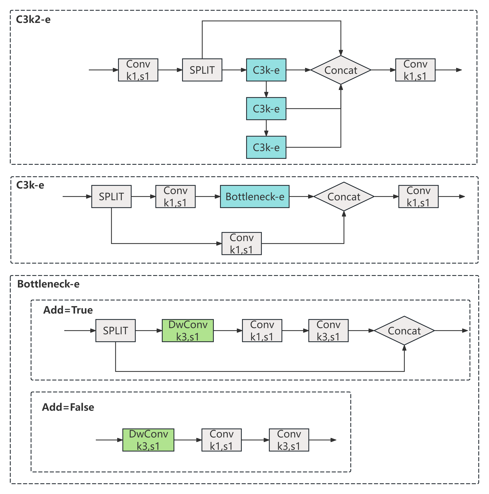

## 1.This is the overall architecture of CCSFNet.

## 2. To achieve a deep learning model for safflower maturity detection that balances accuracy and real-time performance, we designed a new attention mechanism (CAM) that additionally focuses on the center region and a lightweight feature extraction module (C3k2-e). CAM not only improves safflower detection, but more specifically, it focuses on improving performance by focusing on the center region. C3k2-e leverages depthwise separable convolutions to achieve model lightweightness and improve performance on edge devices.

 &nbsp;&nbsp;&nbsp;&nbsp;&nbsp;

## 3. Still trying to figure out your loss function? Or struggling with the time it takes to optimize hyperparameters for your deep learning model? FastGA might be able to help! FastGA eliminates the mutation phase in genetic algorithms, significantly speeding up overall parameter tuning without sacrificing performance. However, this may only be suitable for object detection tasks with a small number of categories and minimal scale variation.

## 4. Below are our detection results on the large red flower dataset.

 &nbsp;&nbsp;&nbsp;&nbsp;&nbsp;

## 5. Due to project process reasons, we cannot make the entire safflower dataset public now, but we have provided a small benchmark that you can download to perform performance testing of the proposed method.

## 6. CCSFNet is efficiently deployed on the Jetson Nano edge device. We have also open-sourced some Python packages that may be useful for edge deployment.

## 7. Thanks to the open source of [ultralytics](https://docs.ultralytics.com/zh), many tasks have become simpler and more traceable.
